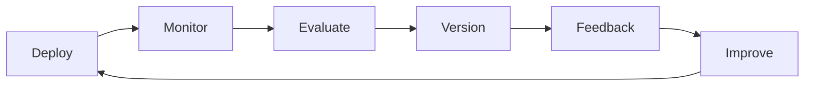

# LLMOps Lifecycle Map for Chatbot

## Phase Explanations

---

1. **Deploy**

   - Launch the chatbot model in production (via Docker container).
   - Stakeholders: DevOps engineers, platform admins.

2. **Monitor**

   - Track usage, errors, and latency with monitoring scripts.
   - Stakeholders: ML engineers, support teams.

3. **Evaluate**

   - Measure performance using collected logs & metrics (e.g., response quality).
   - Stakeholders: Data scientists, QA engineers.

4. **Version**

   - Store new models, datasets, and configurations with version control (Git + model registry).
   - Stakeholders: ML engineers, project leads.

5. **Feedback**

   - Collect structured user feedback (JSON logs, ratings, comments).
   - Stakeholders: End users, product managers.

6. **Improve**
   - Retrain or fine-tune chatbot with new data & feedback.
   - Stakeholders: ML engineers, research team.

---
